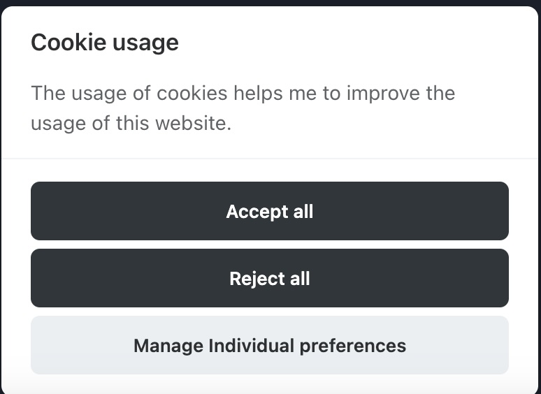

# gatsby-plugin-google-gtag-cookieconsent

This is an altered fork of [gatsby-plugin-google-gtag](https://github.com/gatsbyjs/gatsby/tree/master/packages/gatsby-plugin-google-gtag).

The [README](./README.gtag.md) at the time of the forking.

You can find more detailed information in this blogpost [Cookie Consent with Gatsby and Google Tagmanager](https://stoiccoder.blog/gatsby-consent/).

## Purpose

Easy configurable plugin to have a cookie consent popup with opt-in before loading any gtag script as required by some gdpr laws.

It stitches together the [gatsby-plugin-google-gtag](https://github.com/gatsbyjs/gatsby/tree/master/packages/gatsby-plugin-google-gtag) plugin
with this awesome [cookieconsent](https://github.com/orestbida/cookieconsent) library.

The final result will look like this:



## Usage

Install the plugin via

```bash
npm install --save gatsby-plugin-google-gtag-cookieconsent
```

Add this to your `gatsby-config.js`

```js
    {
      resolve: `gatsby-plugin-google-gtag-cookieconsent`,
      options: {
        cookieConsentConfig: { ... },
        enableForAllEnvironments: true, // deprecated
        enabled: true,
        googleGtagPluginConfig: { ... },
      },
    },
```

You can use the enabled flag to disable the plugin in development mode. An example can be found in [examples/gatsby-config.js](./examples/gatsby-config.js) folder.

In order to save space in your config file, I would recommend to move the extensive cookie consent config into a separate file, e.g. `cookie-consent-config`: 

```js
exports.cookieConsentConfig = {
  categories: {
    necessary: {
      enabled: true, // this category is enabled by default
      readOnly: true, // this category cannot be disabled
    },
    analytics: {},
  },
  language: {
    default: "en",
    translations: {
      en: {
        consentModal: {
          ...
        },
        preferencesModal: {
          ...
        },
      },
    },
  },
};
```

And then import it in your `gatsby-config.js`

```js
const { cookieConsentConfig } = require("./cookie-consent-config");
```

For detailed information of the available config please reference [cookieconsent](https://github.com/orestbida/cookieconsent) or [gatsby-plugin-google-gtag](https://github.com/gatsbyjs/gatsby/tree/master/packages/gatsby-plugin-google-gtag) directly.

Quick example configs can be found in the [examples](./examples) folder.
